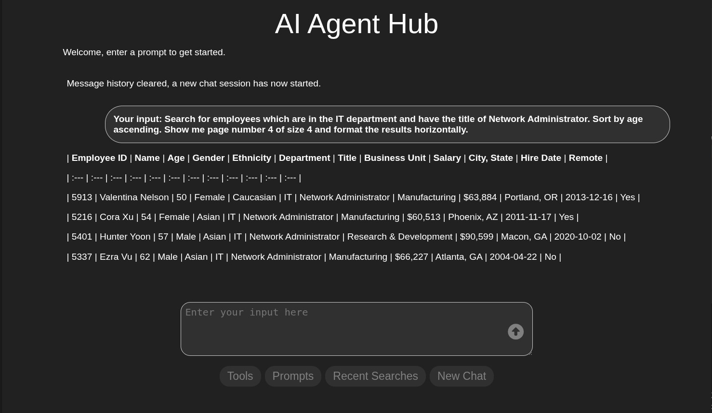

# mcp-human-resources-client
An AI-powered agent hub with a Python Eel web UI, built on Pydantic AI and the Model Context Protocol (MCP). Connects to multiple MCP servers — including a Spring Boot HR backend, Playwright browser automation, and a local filesystem server — to orchestrate employee management, cloud storage, email, image generation, Elasticsearch, and more through natural language.

<p align="center">
  
</p>

## Available Agent Tools

<details>
<summary><strong>Front-End Tools (Python Client)</strong></summary>

| Tool | Description |
|------|-------------|
| **add** | Adds two numbers and returns the sum. |
| **get_geo_location** | Get geolocation coordinates based on city and state. |

> **Note:** The following tools require the [mcp-human-resources](https://github.com/dbrown725/mcp-human-resources) Spring Boot back-end to be running.

| Tool | Description |
|------|-------------|
| **upload_file_to_cloud** | Upload a local file to Google Cloud Storage with an optional destination path. |
| **download_file_from_cloud** | Download a file from Google Cloud Storage to a local directory. |
| **summarize_images_in_folder** | Summarize images in a specified cloud folder. |
| **create_expense_report** | Generate an expense report for images in a specified cloud folder. |
| **create_employee_badge** | Generate an employee badge using name, employee number, and employee image. |
| **query_company_policies_tool** | Query company policies using semantic similarity search (Elasticsearch RAG). |
| **save_draft_email_new** | Save a draft email via the Java endpoint with optional local and cloud attachments. |

</details>

### Back-End MCP Server Tools

<details>
<summary><strong>Playwright MCP Server — Browser Automation</strong></summary>

| Tool | Description |
|------|-------------|
| **browser_navigate** | Navigate to a URL. |
| **browser_click** | Click an element on a web page. |
| **browser_type** | Type text into an editable element. |
| **browser_fill_form** | Fill multiple form fields at once. |
| **browser_snapshot** | Capture an accessibility snapshot of the current page (preferred for actions). |
| **browser_take_screenshot** | Take a screenshot of the current page. |
| **browser_select_option** | Select an option in a dropdown. |
| **browser_hover** | Hover over an element on the page. |
| **browser_drag** | Drag and drop between two elements. |
| **browser_press_key** | Press a key on the keyboard. |
| **browser_file_upload** | Upload one or multiple files. |
| **browser_tabs** | List, create, close, or select a browser tab. |
| **browser_navigate_back** | Go back to the previous page. |
| **browser_evaluate** | Evaluate a JavaScript expression on the page. |
| **browser_console_messages** | Return all console messages. |
| **browser_network_requests** | Return all network requests since the page loaded. |
| **browser_handle_dialog** | Handle a browser dialog. |
| **browser_resize** | Resize the browser window. |
| **browser_run_code** | Run a Playwright code snippet. |
| **browser_wait_for** | Wait for text to appear/disappear or a specified time to pass. |
| **browser_install** | Install the browser specified in the config. |
| **browser_close** | Close the page. |

</details>

<details>
<summary><strong>mcp-human-resources Spring Boot Server — Employee Database, Search & More</strong></summary>

| Tool | Description |
|------|-------------|
| **search_employees** | Paginated employee search with filters for name, age, department, title, gender, ethnicity, dates, salary, and more. |
| **count_employees** | Count employees matching optional filter parameters. |
| **get_employee_with_id** | Get a single employee by ID. |
| **save_employee** | Create a new employee from a full employee object. |
| **save_employee_with_name** | Create a new employee using first and last name. |
| **update_employee** | Update specific fields of an existing employee by ID. |
| **delete_employee_with_id** | Delete a single employee by ID. |
| **search_employees_in_state** | Search employees by US state (full name or 2-letter code). |
| **search_employees_in_city** | Search employees by city (case-insensitive). |
| **search_employees_in_zipcode** | Search employees by ZIP/postal code. |
| **count_employees_in_state** | Count employees in a US state. |
| **count_employees_in_city** | Count employees in a city. |
| **count_employees_in_zipcode** | Count employees by ZIP/postal code. |
| **get_address_with_id** | Get a single address by ID. |
| **save_address** | Create a new address. |
| **delete_address_with_id** | Delete a single address by ID. |
| **fetch_address_list** | Get a list of all addresses. |
| **search_addresses** | Search addresses by city, state, postal code, or remote status. |
| **search** | Perform an Elasticsearch search with a query DSL. |
| **list_indices** | List all available Elasticsearch indices. |
| **get_mappings** | Get field mappings for a specific Elasticsearch index. |
| **get_shards** | Get shard information for all or specific indices. |
| **braveSearch** | Search Brave Search for information and extract entities. |
| **getWeatherForecastByLocation** | Get weather forecast for a specific latitude/longitude. |
| **getAlerts** | Get weather alerts for a US state (two-letter code). |
| **generateImage** | Generate an image from a prompt using Gemini API and upload to GCS. |
| **readInbox** | Read Gmail inbox emails with optional filtering by subject, sender, date range, and read/unread status. |
| **markEmailAsRead** | Mark a specific email as read by Message-ID. |
| **storage_read_file** | Read a file from Google Cloud Storage. |
| **storage_list_files** | List files in a GCS bucket with a given prefix. |
| **storage_list_file_urls** | Return public URLs for all files in a GCS folder. |
| **storage_delete_file** | Delete a file from Google Cloud Storage. |
| **keep_alive** | Returns a keep-alive response. |

</details>

<details>
<summary><strong>Filesystem MCP Server — Local File Operations</strong></summary>

| Tool | Description |
|------|-------------|
| **list_allowed_directories** | List directories this server is allowed to access. |
| **list_directory** | List all files and directories in a path. |
| **list_directory_with_sizes** | List files and directories with sizes. |
| **directory_tree** | Get a recursive tree view of files and directories as JSON. |
| **read_text_file** | Read a file's contents as text. |
| **read_media_file** | Read an image or audio file as base64 encoded data. |
| **read_multiple_files** | Read multiple files simultaneously. |
| **write_file** | Create or overwrite a file with new content. |
| **edit_file** | Make line-based edits to a text file. |
| **create_directory** | Create a new directory or ensure it exists. |
| **move_file** | Move or rename files and directories. |
| **search_files** | Recursively search for files matching a pattern. |
| **get_file_info** | Retrieve detailed metadata about a file or directory. |

</details>

## Installation
Assumes Linux with the latest python, node and npm

1. Install uv (A fast Python package installer and resolver):

```bash
curl -LsSf https://astral.sh/uv/install.sh | sh
You may need to close your terminal and open a new one afterwards.
```

2. Clone the repository:

```bash
git clone https://github.com/dbrown725/mcp-human-resources-client.git
cd mcp-human-resources-client
```

3. Create a new virtual environment and activate it:

```bash
uv venv
source .venv/bin/activate
#Later to exit your virtual environment
deactivate
```
4. Install Node module(s):
```bash
npm i @executeautomation/playwright-mcp-server
npm i @modelcontextprotocol/server-filesystem
```

5. Install dependencies:

```bash
uv pip install -r requirements.txt
```
<b> Steps 6 below can be skipped by creating an .env file at the base of the project and including your appropriate values.<br>
GROQ_API_KEY=... or GEMINI_API_KEY=... or OPENROUTER_API_KEY=...<br>
LOCAL_FILE_STORAGE=...<br>
BACKEND_SERVER_URL=...<br>
SESSION_KEEP_ALIVE_MINUTES=...

6. Export API Keys for your preferred LLM, tested with GROQ and Google Gemini:

```bash
export GROQ_API_KEY=<YOUR_GROQ_API_KEY>
or
export GEMINI_API_KEY=<YOUR_GEMINI_API_KEY>
or
export OPENROUTER_API_KEY=<YOUR_OPENROUTER_API_KEY>
```

7. If using tools.upload_file_to_cloud, tools.download_file_from_cloud or servers.filesystem_mcp_server<br>
```bash
export LOCAL_FILE_STORAGE=<A local file directory to be used for general file access and/or uploading/downloading files.>
``` 

8. Set the backend server URL (defaults to http://localhost:8081 if not set)<br>
```bash
export BACKEND_SERVER_URL=<URL of the mcp-human-resources Spring Boot backend, e.g. http://localhost:8081>
``` 

9. Set your preferred session timeout period in minutes. This represents the period of time allowed between user request submission.<br>
```bash
export SESSION_KEEP_ALIVE_MINUTES=<For example 15 for a fifteen minute timeout>
``` 

10. Setup log directory and file
```bash
sudo mkdir /var/log/mcp-human-resources-client
sudo touch /var/log/mcp-human-resources-client/mcp-human-resources-client.log
sudo chmod -R 777 /var/log/mcp-human-resources-client
```

11. Setup Logfire<br>
    Follow Logfire Getting Started instructions: https://logfire.pydantic.dev/docs/

12. If testing against the mcp-human-resources Spring Boot app<br>
    Clone, build and run: https://github.com/dbrown725/mcp-human-resources

13. Update the agent object instantiation in agent.py with specific tools, model and mcp servers you are using.<br><br>
    For instance if you aren't using gmail then:<br>
        tools=[tools.add, tools.saveDraftEmailContent, tools.getGeoLocation],<br>
    changes to<br>
        tools=[tools.add, tools.getGeoLocation], <br><br>
    if you aren't using the mcp-human-resources Spring Boot app then<br>
    mcp_servers=[servers.playwright_mcp_server, servers.mcp_human_resources_server])<br>
    changes to<br>
    mcp_servers=[servers.playwright_mcp_server])<br><br>
    Configure your preferred model, see Pydantic AI guide:<br>
    https://ai.pydantic.dev/models/

14. To Run<br>
        If using mcp_human_resources_server make sure the app is started<br>
        then<br>
        python3 main.py     